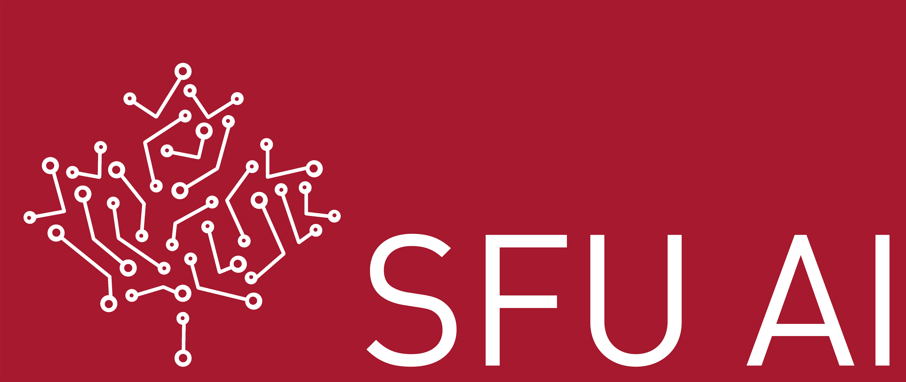
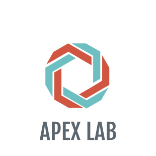
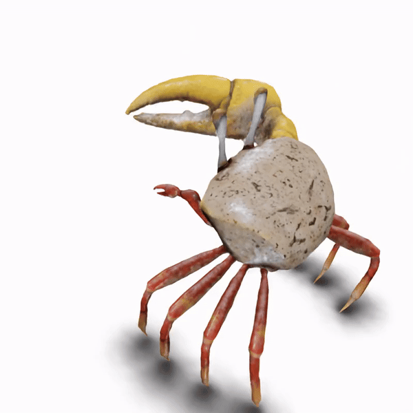

# PAPR in Motion: Seamless Point-level 3D Scene Interpolation (CVPR 2024 Highlight 🤩)
[Shichong Peng](https://sites.google.com/view/niopeng/home), [Yanshu Zhang](https://zvict.github.io/), [Ke Li](https://www.sfu.ca/~keli/)<br>



[Project Site](https://niopeng.github.io/PAPR-in-Motion/)
 | [Paper](https://arxiv.org/abs/2406.05533) | [Video](https://youtu.be/vysmn3TN4FY) | [Data](https://1sfu-my.sharepoint.com/:f:/g/personal/spa176_sfu_ca/EueJQ8wniWZOmbCZLjhrDioBsnEi_LPLZ577fUSuvgvj-Q?e=TsqWV8) | [Pretrained Models](https://1sfu-my.sharepoint.com/:f:/g/personal/spa176_sfu_ca/EjH3JVt4bT9LnbOALkPmHG4BLRoYeTNbMdwAu3FP6qAfcA?e=N3g3gp)

We introduce the novel problem of **point-level 3D scene interpolation**. Given observations of a scene at two distinct states from multiple views, the goal is to synthesize a smooth point-level interpolation between them, **without any intermediate supervision**. Our method, **PAPR in Motion**, builds upon the recent [Proximity Attention Point Rendering (PAPR)](https://zvict.github.io/papr/) technique, and generates seamless interpolations of both the scene geometry and appearance.

<div align="center">
  
  
  
  
</div>


## Installation
```
git clone git@github.com:niopeng/PAPR-in-Motion.git
cd PAPR-in-Motion
conda env create -f papr.yml
conda activate papr
```
Or use virtual environment with `python=3.10`
```
python -m venv path/to/<env_name>
source path/to/<env_name>/bin/activate
pip install -r requirements.txt
```

## Dataset

### Objaverse Scenes
Download the rendered scenes from Objaverse Dataset [here](https://1sfu-my.sharepoint.com/:f:/g/personal/spa176_sfu_ca/EueJQ8wniWZOmbCZLjhrDioBsnEi_LPLZ577fUSuvgvj-Q?e=TsqWV8) and put it under `data/`. Each scene contains a start state and an end state.

### Create your own data
You can refer to this [issue](https://github.com/zvict/papr/issues/3#issuecomment-1907260683) for the instructions on how to prepare the dataset.

You need to create a new configuration file for your own dataset, and put it under `configs`. The parameter `dataset.type` in the configuration file specifies the type of the dataset. If your dataset is in the same format as the NeRF Synthetic dataset, you can directly set `dataset.type` to `"synthetic"`. Otherwise, you need to implement your own python script to load the dataset under the `dataset` folder, and add it in the function `load_meta_data` in `dataset/utils.py`.

## Training
The training process consists of three stages:
1. **Start State Pre-training**: In this initial stage, a PAPR model is trained on the start state from scratch.
2. **End State Geometry Fine-tuning**: The second stage involves fine-tuning the PAPR model to align with the geometry of the end state. All parameters from the first stage's PAPR model are fixed, except for the point positions. Initially, two regularization techniques (rigid loss and Local Displacement Averaging Step) are applied to quickly adjust the points to approximate the end state positions. Subsequently, Local Displacement Averaging Step is disabled, and the rigid loss is maintained to further refine the point cloud to match the end state geometry. To control the rigidity of the moving parts during interpolation, adjust the `training.regularizers.num_nn` option in the config files. A higher value increases the rigidity of the moving parts during interpolation.
3. **End State Appearance Fine-tuning**: In the final stage, the point feature vectors and the proximity attention model are fine-tuned to capture the appearance differences between the start and end states.
To run each stage, use the following commands:

```
# Start state pre-training
python train.py --opt configs/train/{scene}-stage-0.yml

# End state geometry finetuning
python train.py --opt configs/train/{scene}-stage-1.yml

# End state appearance finetuning
python train.py --opt configs/train/{scene}-stage-2.yml
```

## Evaluation
To create scene interpolations between the start and end states, use the command below. This will save both the geometry and appearance interpolations of the scene.

```
python test_interpolation.py --opt configs/test/test-{scene}.yml
```


## Pretrained Models
We provide the pretrained models of both synthetic and real-world scenes [here](https://1sfu-my.sharepoint.com/:f:/g/personal/spa176_sfu_ca/EjH3JVt4bT9LnbOALkPmHG4BLRoYeTNbMdwAu3FP6qAfcA?e=N3g3gp). Please unzip and put them under `experiments/`. 

## Try out your own scenes
We also provide generic configuration files in `configs/train/example_stage_{0-2}.yml` for training with your own scenes, along with a sample configuration file for visualizing the scene interpolation in `configs/test/test_example.yml`.

## BibTeX
```
@inproceedings{peng2024papr,
    title={PAPR in Motion: Seamless Point-level 3D Scene Interpolation},
    author={Shichong Peng and Yanshu Zhang and Ke Li},
    booktitle={IEEE/CVF Conference on Computer Vision and Pattern Recognition (CVPR)},
    year={2024}
}
```


## Acknowledgement
This research was enabled in part by support provided by NSERC, the BC DRI Group and the Digital Research Alliance of Canada.
